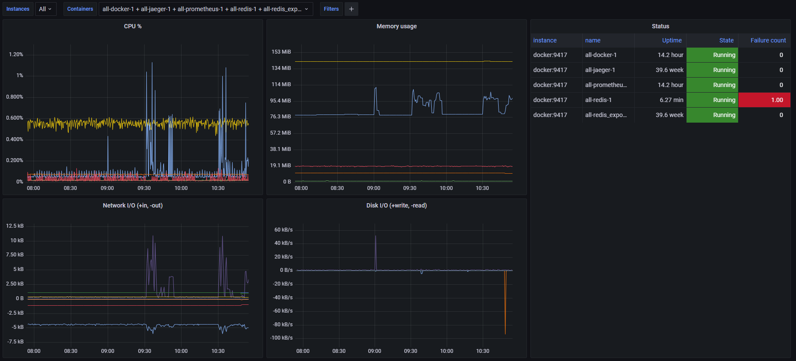
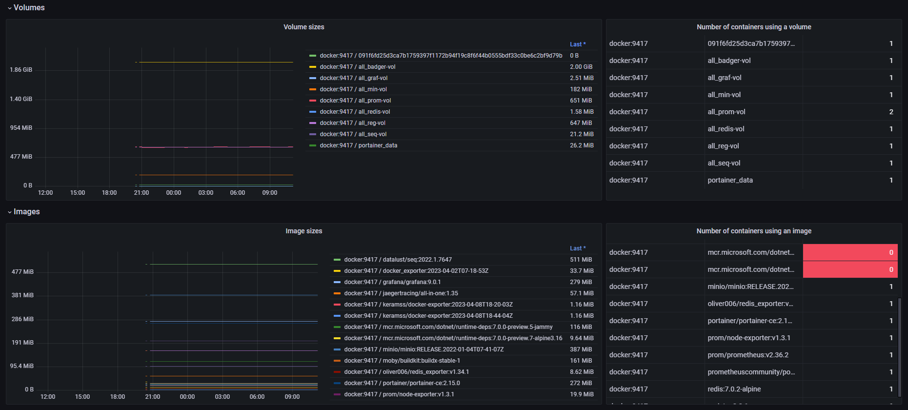

# docker-exporter

 [](https://hub.docker.com/r/keramss/docker-exporter)

Minimal [Prometheus](https://github.com/prometheus/prometheus) exporter for Docker, <1MB compressed image size, <2MB memory footprint. Collects container metrics and optionally also images and volumes.

## Supported platforms

- linux/amd64
- linux/arm64

## Getting started

Image available on [Docker Hub](https://hub.docker.com/r/keramss/docker-exporter).

Configuration via environment variables:
- `VERBOSE` - enables verbose logging (off by default)
- `COLLECT_VOLUME_METRICS` - enables volume metrics collection (off by default)
- `COLLECT_IMAGE_METRICS` - enables image metrics collection (off by default)

To run the exporter, use docker-compose.yml:

```yml
version: '3.7'
  services:
    docker-exporter:
      image: keramss/docker-exporter:2023-07-22T09-48-10Z
      restart: unless-stopped
      environment:
        # VERBOSE: 'true'
        # COLLECT_VOLUME_METRICS: 'true'
        # COLLECT_IMAGE_METRICS: 'true'
      ports:
        - "9417:9417"
      volumes:
        - /var/run/docker.sock:/var/run/docker.sock
```

or the following command:

```
docker run -d \
    --name docker-exporter \
    -p 9417:9417 \
    -v /var/run/docker.sock:/var/run/docker.sock \
    keramss/docker-exporter:2023-07-22T09-48-10Z
```

Finally, add a new job to `prometheus.yml`.

```yml
scrape_configs:
  # ...
  - job_name: 'docker'
    fallback_scrape_protocol: PrometheusText0.0.4
    static_configs:
    - targets: ['your-docker-host:9417']
```

## Docker API compatibility

Unix socket only. Requires that the minimum supported API version of your Docker engine be 1.25 or lower.

## Collected metrics

### Containers

- `docker_container_cpu_capacity_total` - All potential CPU usage available to a container, in unspecified units, averaged for all logical CPUs usable by the container. Start point of measurement is undefined - only relative values should be used in analytics.
  
  Labels: name

- `docker_container_cpu_used_total` - Accumulated CPU usage of a container, in unspecified units, averaged for all logical CPUs usable by the container.

  Labels: name

- `docker_container_memory_used_bytes` - Memory usage of a container.

  Labels: name

- `docker_container_network_in_bytes` - Total bytes received by the container's network interfaces.

  Labels: name

- `docker_container_network_out_bytes` - Total bytes sent by the container's network interfaces.

  Labels: name

- `docker_container_disk_read_bytes` - Total bytes read from disk by a container.

  Labels: name

- `docker_container_disk_write_bytes` - Total bytes written to disk by a container.

  Labels: name

- `docker_container_restart_count` - The number of times the runtime has restarted this container without explicit user action, since the container was last started.

  Labels: name

- `docker_container_running_state` - Whether the container is running (1), restarting (0.5) or stopped (0).

  Labels: name

- `docker_container_start_time_seconds` - Unix timestamp indicating when the container was started. Does not get reset by automatic restarts.

  Labels: name

### Volumes

- `docker_volume_container_count` - The number of containers using a volume.

  Labels: name

- `docker_volume_size` - The size of a volume in bytes.

  Labels: name

### Images

- `docker_image_container_count` - The number of containers based on an image.

  Labels: tag (may contain image ID if tags are empty or `<none>:<none>`)

- `docker_image_size` - The size of on an image in bytes.

  Labels: tag (may contain image ID if tags are empty or `<none>:<none>`)

### Overall

- `docker_probe_duration_seconds_bucket` - A histogram of how long it takes to query Docker for the complete data set.

- `docker_probe_failures_total` - The number of times any individual Docker query failed (because of a timeout or other reasons).

## Grafana dashboard

[Grab it here.](dashboard.json)




